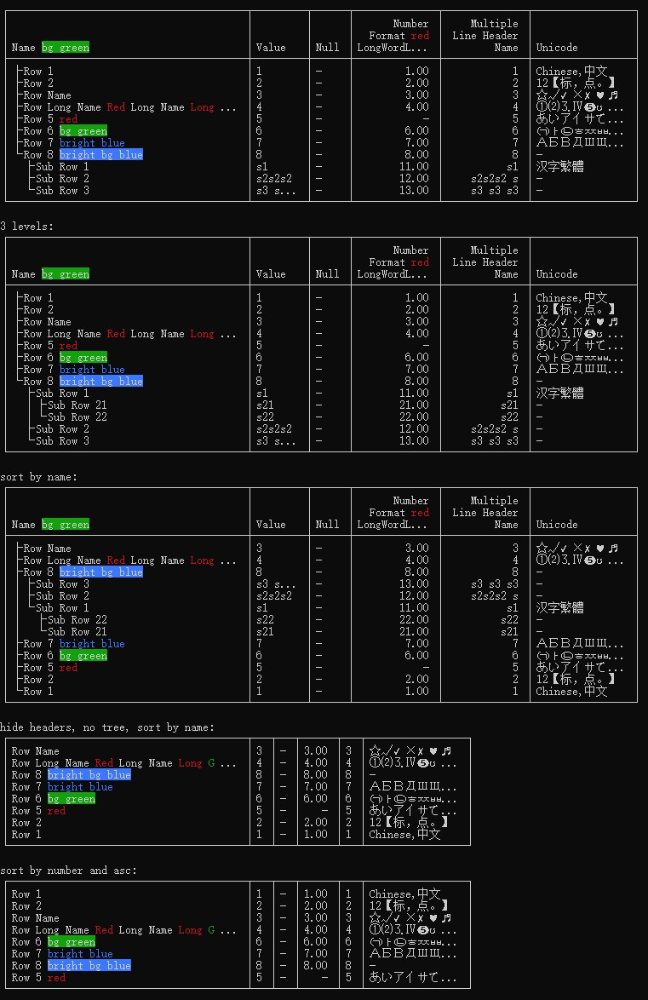

# console-grid

* Console log a grid with tree style rows
* Color cells
* Customize cell formatter
* Column sorting
* Multiple lines header
* Zero Dependencies and Pure Vanilla Javascript
* Simple & Easy to use, Extremely Lightweight


# Install
```
npm install console-grid
```
# Preview
```
┌────────────────────────────────────────┬─────────┬──────┬──────────────┬──────────────┐
│                                        │         │      │       Number │     Multiple │
│                                        │         │      │   Format red │  Line Header │
│ Name bg green                          │ Value   │ Null │ LongWordL... │         Name │
├────────────────────────────────────────┼─────────┼──────┼──────────────┼──────────────┤
│ ├ Row Name                             │ 3       │ -    │         3.00 │            3 │
│ ├ Row Long Name Red Long Name Long ... │ 4       │ -    │         4.00 │            4 │
│ ├ Row 8 bright bg blue                 │ 8       │ -    │         8.00 │            8 │
│ │ ├ Sub Row 3                          │ s3 s... │ -    │        13.00 │     s3 s3 s3 │
│ │ ├ Sub Row 2                          │ s2s2s2  │ -    │        12.00 │     s2s2s2 s │
│ │ └ Sub Row 1                          │ s1      │ -    │        11.00 │           s1 │
│ │   ├ Sub Row 22                       │ s22     │ -    │        22.00 │          s22 │
│ │   └ Sub Row 21                       │ s21     │ -    │        21.00 │          s21 │
│ ├ Row 7 bright blue                    │ 7       │ -    │         7.00 │            7 │
│ ├ Row 6 bg green                       │ 6       │ -    │         6.00 │            6 │
│ ├ Row 5 red                            │ 5       │ -    │            - │            5 │
│ ├ Row 2                                │ 2       │ -    │         2.00 │            2 │
│ └ Row 1                                │ 1       │ -    │         1.00 │            1 │
└────────────────────────────────────────┴─────────┴──────┴──────────────┴──────────────┘
hide headers, no tree, sort by name:
┌────────────────────────────────────────┬─────┬─────┬──────┬─────┐
│ Row Name                               │ 3   │ -   │ 3.00 │   3 │
│ Row Long Name Red Long Name Long G ... │ 4   │ -   │ 4.00 │   4 │
│ Row 8 bright bg blue                   │ 8   │ -   │ 8.00 │   8 │
│ Row 7 bright blue                      │ 7   │ -   │ 7.00 │   7 │
│ Row 6 bg green                         │ 6   │ -   │ 6.00 │   6 │
│ Row 5 red                              │ 5   │ -   │    - │   5 │
│ Row 2                                  │ 2   │ -   │ 2.00 │   2 │
│ Row 1                                  │ 1   │ -   │ 1.00 │   1 │
└────────────────────────────────────────┴─────┴─────┴──────┴─────┘
```

# Usage
```js
var ConsoleGrid = require("console-grid");
var grid = new ConsoleGrid();
var data = {
    option: {
        sortField: "name"
    },
    columns: [{
        id: "name",
        name: "Name",
        type: "string",
        maxWidth: 38
    }, {
        id: "value",
        name: "Value",
        type: "string",
        maxWidth: 7,
        formatter: (v, row, column) => {
            return v;
        }
    }],
    rows: [{
        name: "Row 1",
        value: "1"
    }, {
        name: "Row 2",
        value: "2"
        subs: [{
            name: "Sub Row 1",
            value: "s1"
        }, {
            name: "Sub Row 2",
            value: "s2"
        }]
    }]
};
//returns lines could be saved to log file
var lines = grid.render(data);
```

# Default Option
```js
option = {
    border: {
        h: '─',
        v: '│',
        top_left: '┌',
        top_mid: '┬',
        top_right: '┐',
        mid_left: '├',
        mid_mid: '┼',
        mid_right: '┤',
        bottom_left: '└',
        bottom_mid: '┴',
        bottom_right: '┘'
    },

    silent: false,
    hideHeaders: false,

    padding: 1,
    defaultMinWidth: 1,
    defaultMaxWidth: 50,

    sortField: "",
    sortAsc: false,

    treeId: "name",
    treeIcon: "├ ",
    treeLink: "│ ",
    treeLast: "└ ",
    treeIndent: "  ",
    defaultTreeFormatter: this.defaultTreeFormatter,
    defaultFormatter: this.defaultFormatter,
    nullPlaceholder: "-"
}
console.log(grid.defaultOption());
```

# Column properties
```js
column = {
    id: String,
    name: String,
    type: String, //string, number
    align : String, //left, right
    minWidth: Number,
    maxWidth: Number,
    formatter: Function //cell formatter
}
```

# Row properties
```js
row = {
    //column id key: cell value
    subs: Array //sub rows
}
```

# Color API
```js
var ConsoleGrid = require("console-grid");
var CGS = ConsoleGrid.Style;
//'black', 'red', 'green', 'yellow', 'blue', 'magenta', 'cyan', 'white'
console.log(CGS.red("Red"));
console.log(CGS.bg.green("bg green"));
```

# Example test
[test.js](test/test.js)
```
npm run test
```


# CHANGELOG

### v1.0.16
* fixed empty name issue
* fixed output log mixing

### v1.0.15
* fixed invalid header name with column id
* added row.innerBorder
---

### v1.0.14
* support fullWidth Unicode
---